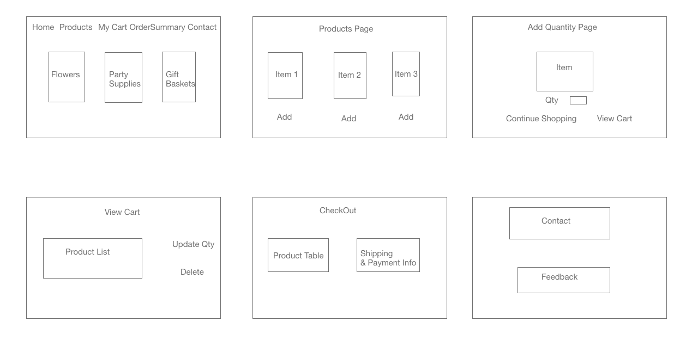

### Deployed Link

### Wireframe

### Installations needed

npm install axios, sass, react-bootstrap, react-router-dom

### API used:
https://rainforestapi.com/

## Problem Statement:
The stakeholders currently have only one physical retail store, limiting the potential to reach more clients.
They are looking to expand the business to more clients through a digital platform.

## Proposition:
Creating an e-commerce store which allows customers to make online purchase using react for front-end framework and backend deployed with Springboot JPA

## Target End Users:
Customers who prefer online shopping.

## Next Steps:
Create checkout and total payment and validations, authentication functionality.
